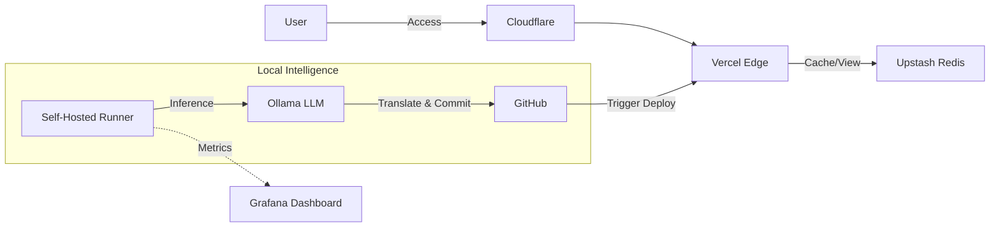
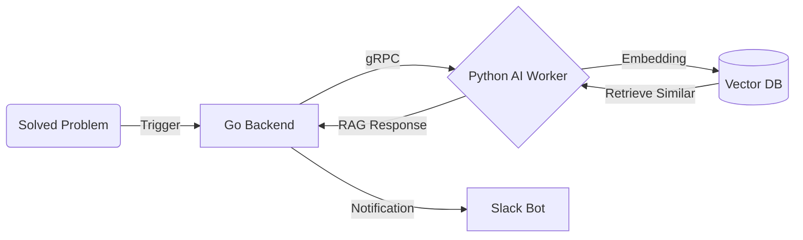

  

  
  

 

<table>
  <tr>
    <td width="76%" valign="top">
      <h3>About Me</h3>
      

        <b>"My best ideas come from my daily walks."</b>
      

      

        I am an engineer who finds inspiration in everyday life—whether it's language learning, stock markets, or finding better mobile plans—and turns them into working AI services. I don't limit myself to a single domain; if it's a problem I face, I build a solution.
      

       
      <b>Origin of Ideas</b>
      My projects begin with a personal need.
      <ul>
        <li>Saw a language app ad but found features missing? <b>I built the extension.</b></li>
        <li>Wanted to grow assets without active management? <b>I engineered an AI trader.</b></li>
      </ul>
      

      <b>I turn "I wish this existed" into deployed software.</b>
      

    </td>
    <td width="24%" valign="top">
      <h3>Tech Stack</h3>
      <b>Languages</b> 
      
      
      
       
      <b>Frameworks</b> 
      
      
       
      <b>AI & Data</b> 
      
      
      
       
      <b>Infra & Tools</b> 
      
      
      
    </td>
  </tr>
</table>

<h3>Released & Operational</h3>

| Project | Description | Stack | Link |
| :--- | :--- | :--- | :--- |
| **[hunbot.dev](https://github.com/Hun-Bot2/hunbot.dev)** | **Engineering Blog with AI Pipeline** Static site with **Local AI** that auto-translates posts & commits via GitHub Actions. | `Astro` `Ollama` `Redis` | [Live ↗](https://hun-bot.dev) |
| **[Algo-Review Bot](https://github.com/Hun-Bot2/algo-review-bot)** | **Study Automation Agent** RAG-based problem recommender connecting Baekjoon & LeetCode. | `Go` `Python` `VectorDB` | [Code ↗](https://github.com/Hun-Bot2/algo-review-bot) |
| **[Local LLM Ops](https://github.com/Hun-Bot2/local-llm-observability)** | **MLOps Utility** Monitoring dashboard for the Local Ollama instance used in the blog pipeline. | `Grafana` `Python` | [Code ↗](https://github.com/Hun-Bot2/local-llm-observability) |
| **[BKGA Extension](https://github.com/Hun-Bot2/smart-korean-grammar-assistant)** | **VSCode Utility** Korean grammar checker for technical writing. | `TypeScript` | [Blog ↗](https://hun-bot.dev/ko/blog/devlog/vscode_extension/vscode_extension_01/) |

 

  👉 <b>For clear Architecture Images (PNG), please click the <a href="#released--operational">Blog</a> or <a href="#released--operational">Repo</a> links in the table above.</b>

 

<b>View System Architectures (Blog & Bots)</b>

 
<b>1. hunbot.dev (BlogOps Architecture)</b>

<b>View Algorithm Bot Architecture</b>

 

<h3> In Development</h3>

| Project | Description | Stack | Link |
| :--- | :--- | :--- | :--- |
| **JP Biz Coach** | **Japanese Communication AI** Business conversation & JLPT N1 speaking practice app. | `Go` `OpenAI` `TTS` | `🚧 Developing` |
| **Market Watcher** | **Multimodal Stock Trader** Analyzing Japanese market charts and news. | `Python` `Vision API` | `🚧 Developing` |
| **Add-on Dr.** | **Utility Service** Finding hidden carrier add-on services. | `Go` `Scraping` | `🚧 Developing` |
